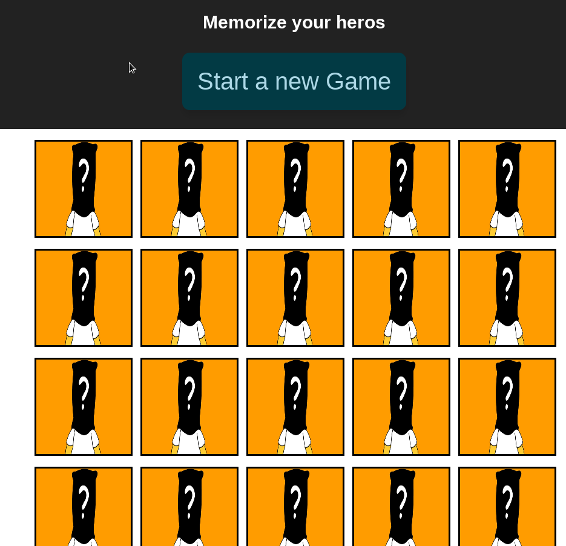
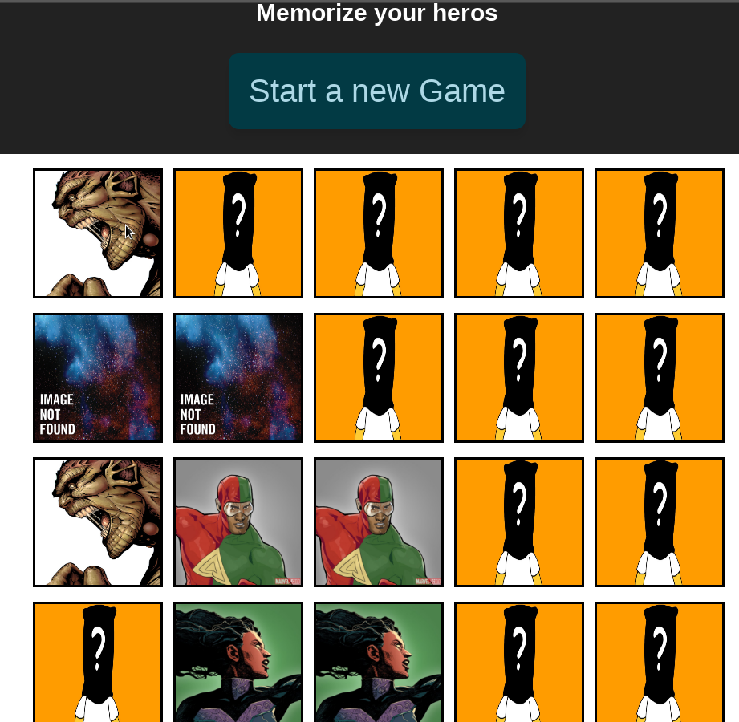

# Match marvel heros

This is a clasic game that was implemented with the goal to learn the basics of react and redux.

## Requirements 

  * Nodejs

## Run Locally

  * git clone
  * npm install
  * npm start

Browse to http://localhost:3000/

## Description

This is using the marvel API to get the heros and any time you start a new game this cards are mixed.

Click on Start new game button and try it!

  * 

  * 